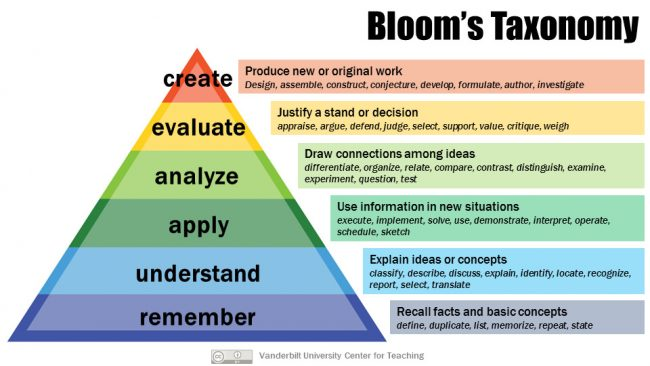

# Getting back to to the basics 

Let’s compare and contrast the common **data structures and algorithms** using Bloom's taxonomy levels **Analysis (Level 4)** and **Evaluation (Level 5)**, considering their applications, advantages, and limitations.

### 1. Arrays vs. Linked Lists

#### **Analysis (Level 4)**:
- **Arrays**:
  - Fixed size (in most languages) and elements are stored in contiguous memory.
  - Access time for an element is **O(1)** (constant) due to index-based access.
  - Insertion/deletion in the middle takes **O(n)** due to shifting elements.
  
- **Linked Lists**:
  - Dynamic size and elements are not stored in contiguous memory (each node points to the next).
  - Access time is **O(n)** since you need to traverse the list to reach an element.
  - Insertion/deletion in the middle takes **O(1)** if you already have the node reference.

#### **Evaluation (Level 5)**:
- **When to use Arrays**: 
  - Ideal when the size is known beforehand and quick random access is needed. Works well for **read-heavy** operations.
  
- **When to use Linked Lists**: 
  - Useful when memory needs to be dynamically allocated, and there are frequent insertions/deletions (especially in the middle). Works well for **write-heavy** operations.
  
- **Conclusion**: Arrays are efficient for indexed access, but linked lists excel when you need dynamic resizing and frequent modifications.

---

### 2. Binary Search Tree (BST) vs. Balanced Trees (AVL, Red-Black Trees)

#### **Analysis (Level 4)**:
- **BST**:
  - Allows for efficient searching, insertion, and deletion in **O(log n)** time when balanced.
  - Can become skewed (degenerate to linked list) in worst cases, leading to **O(n)** operations.
  
- **AVL and Red-Black Trees**:
  - Self-balancing trees that maintain height balance.
  - AVL ensures that the height difference between subtrees is at most 1, making it more strictly balanced than Red-Black Trees.
  - AVL tree operations are **O(log n)** for search, insertion, and deletion but involve more rotations than Red-Black Trees.
  - Red-Black Trees provide less rigid balancing but are slightly faster for insertions and deletions in practice due to fewer rotations.

#### **Evaluation (Level 5)**:
- **When to use BST**:
  - Ideal for relatively balanced data where balancing is not a concern. Easy to implement but beware of worst-case scenarios.
  
- **When to use AVL Tree**:
  - Better suited for applications where frequent lookups and updates occur, and you need more strict balance to ensure consistent **O(log n)** performance.
  
- **When to use Red-Black Tree**:
  - Works well in applications like **databases** where insertion/deletion is more frequent, and less strict balancing is acceptable (e.g., Java’s TreeMap uses Red-Black Trees).
  
- **Conclusion**: Use AVL for faster lookups (more balanced), but choose Red-Black Trees for frequent updates (fewer rotations). Standard BSTs can be risky if they become unbalanced.

---

### 3. BFS vs. DFS (in Trees and Graphs)

#### **Analysis (Level 4)**:
- **BFS (Breadth-First Search)**:
  - Explores neighbors level by level.
  - Uses a queue, which results in **O(V + E)** time complexity (V = vertices, E = edges).
  - BFS guarantees the **shortest path** in unweighted graphs.
  
- **DFS (Depth-First Search)**:
  - Explores as far as possible along a branch before backtracking.
  - Uses a stack (or recursion) with **O(V + E)** time complexity.
  - DFS is useful for **cycle detection**, **topological sorting**, and **finding connected components**.

#### **Evaluation (Level 5)**:
- **When to use BFS**:
  - Best for finding the shortest path in unweighted graphs or levels in trees (e.g., finding shortest path in a maze or social network connections).
  
- **When to use DFS**:
  - Ideal when you need to traverse deep into the graph/tree, like finding **connected components**, **cycles**, or **topological ordering** in a graph.
  
- **Conclusion**: BFS is optimal for shortest paths and level-wise exploration, while DFS is better for tasks like cycle detection or exploring deep structures.

---

### 4. Min/Max Heaps vs. Priority Queues

#### **Analysis (Level 4)**:
- **Heaps**:
  - A binary tree-based structure that ensures the parent node is smaller (min-heap) or larger (max-heap) than its children.
  - Insertion, deletion, and finding the min/max takes **O(log n)**.
  
- **Priority Queues**:
  - Can be implemented using heaps or other data structures like balanced binary search trees.
  - Provides efficient extraction of the highest or lowest priority element.
  - Operations depend on the underlying implementation but can be **O(log n)** when using a heap.

#### **Evaluation (Level 5)**:
- **When to use Heaps**:
  - Great for managing dynamically changing datasets where you need to frequently extract min/max values (e.g., **Dijkstra’s algorithm** for shortest paths).
  
- **When to use Priority Queues**:
  - Best when you need to manage elements with priority-based extraction. If implemented with heaps, priority queues maintain efficient access to the highest priority item.
  
- **Conclusion**: Heaps are specialized for quick extraction of min/max elements, while priority queues offer more general priority-based processing.

---

### 5. Hash Tables vs. Binary Search Trees

#### **Analysis (Level 4)**:
- **Hash Tables**:
  - Store key-value pairs with average **O(1)** time complexity for insert, delete, and search, assuming low collision rates.
  - Collisions are handled using techniques like chaining or open addressing.
  
- **Binary Search Trees (BST)**:
  - Provides **O(log n)** time complexity for balanced trees in insertion, deletion, and search.
  - BSTs maintain the order of elements, whereas hash tables do not.

#### **Evaluation (Level 5)**:
- **When to use Hash Tables**:
  - Ideal for quick lookups when you don’t need to maintain the order of elements (e.g., for **symbol tables** in compilers, caching, or counting).
  
- **When to use BSTs**:
  - Best when you need ordered data, such as finding the kth smallest element or range-based queries. Also useful when keys need to be stored in sorted order.
  
- **Conclusion**: Hash tables provide faster access for lookups and updates, but BSTs are more useful when the order of elements is important.

---

### 6. Dynamic Programming vs. Greedy Algorithms

#### **Analysis (Level 4)**:
- **Dynamic Programming (DP)**:
  - Solves complex problems by breaking them into subproblems, solving each subproblem only once, and storing the results (memoization).
  - Useful when problems have **overlapping subproblems** and **optimal substructure** (e.g., Fibonacci, knapsack).
  - Time complexity often **O(n)** or **O(n^2)** depending on the problem.

- **Greedy Algorithms**:
  - Make a series of choices, each of which looks the best at the moment, with the hope of finding a global optimum.
  - Greedy algorithms do not always guarantee optimal solutions but are often faster, with time complexity **O(n)**.
  
#### **Evaluation (Level 5)**:
- **When to use DP**:
  - Best for problems like **knapsack**, **Fibonacci**, **shortest paths in weighted graphs** (Bellman-Ford), where decisions are interdependent and you need to store intermediate results to avoid recomputation.
  
- **When to use Greedy**:
  - Ideal for problems where local decisions lead to global optimum (e.g., **Dijkstra’s algorithm**, **Huffman encoding**, **Activity selection problem**).
  
- **Conclusion**: DP is optimal for problems with overlapping subproblems, while greedy algorithms are faster but should be used when local optima can lead to a global optimum.

---

### 7. Sliding Window vs. Two Pointer Technique

#### **Analysis (Level 4)**:
- **Sliding Window**:
  - A technique where a window (subarray) is moved across the input array to find an optimal solution, such as the maximum sum of a subarray of fixed length.
  - Time complexity is **O(n)**, as each element is processed once.
  
- **Two Pointer Technique**:
  - Involves having two pointers that traverse the input array from different directions to find pairs of elements that satisfy a condition (e.g., sorting-related problems).
  - Efficient for **sorted arrays** and typically runs in **O(n)** or **O(n log n)** when combined with sorting.
  
#### **Evaluation (Level 5)**:
- **When to use Sliding Window**:
  - Best for problems where you need to find subarrays or subsegments (e.g., maximum sum of subarray, longest substring without repeating characters).
  
- **When to use Two Pointers**:
  - Ideal for finding pairs or combinations of elements in sorted arrays (e.g., 2-sum problem, **merging two sorted lists**, or partitioning problems).
  
- **Conclusion**: Sliding window is suited for subarray-based problems, while two-pointer techniques are more applicable for pair-based problems.

---